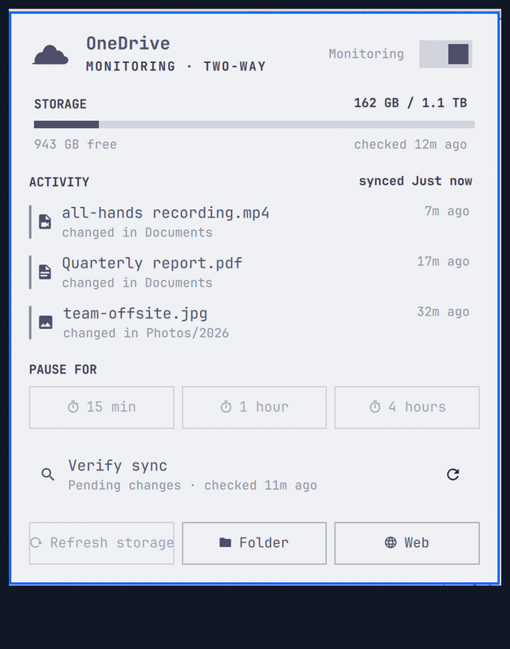
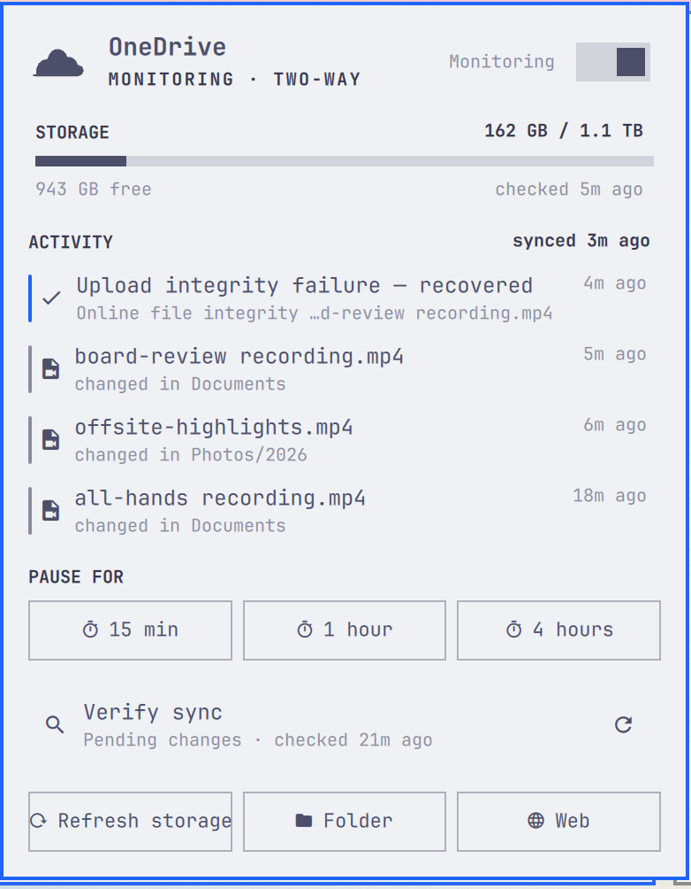
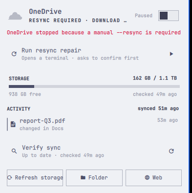

# OmaOneDrive

OneDrive for the Omarchy Quattro bar. OmaOneDrive connects to the installed
[OneDrive Client for Linux](https://github.com/abraunegg/onedrive), follows its
systemd user service, and presents the same sort of compact status panel as
Omarchy's Dropbox widget.

## Demo



Everything in the demo happened for real on a live Omarchy desktop: a file
dropped into the sync folder uploads with live progress, sync is paused and
resumed from the panel, and the network is physically cut mid-upload —
OmaOneDrive reports the interruption, the client's retries, the attention
state, and the recovery exactly as the client logged them.

## Screenshots







Captured against a real OneDrive account on a live Omarchy desktop.

## What it does

- Shows whether OneDrive is monitoring, syncing, paused, or needs attention,
  including the file currently being uploaded or downloaded while a sync runs,
  with a progress percentage when the client reports one. Uploads the client
  starts on its own when it notices a local change — outside a full sync
  pass — are shown live the same way, and completing one refreshes the
  synced-ago meta. During reconciliation passes it shows the current phase,
  including cloud fetch, item processing, local database verification, local
  upload scanning, and final true-up. If connectivity drops mid-transfer, the
  status reports the interruption and the client's retries instead of
  freezing on a stale percentage.
- Sends desktop notifications when OneDrive fails, needs reauthentication or a
  resync, recovers, or when cloud storage crosses 90% full. Clicking a failure
  notification opens the panel or starts the repair. Can be disabled in the
  widget settings.
- Offers a guided resync repair when the client demands one: it opens the CLI's
  own interactive `--resync` flow in a terminal, where the CLI asks for
  confirmation before anything runs.
- Distinguishes two-way, download-only, and upload-only configurations, and
  reports disabled, starting, failed, reauthentication, and resync-required
  service states instead of treating all stopped clients as paused.
- Adds distinct missing-client, login, paused, and syncing badges to the bar
  icon, with a plain dot for the healthy monitoring state.
- Pauses and resumes `onedrive.service` from a native Omarchy toggle, with
  suggested 15-minute, 1-hour, and 4-hour timed pauses.
- Opens the CLI's browser-based login flow in a terminal when authentication is
  missing, and offers the CLI's explicit reauthentication flow when an existing
  authorization has expired.
- Shows used and free cloud storage in a compact usage meter that turns urgent
  past 90% full.
- Merges service errors and recent local changes into an honest activity
  timeline. Multi-line CLI error blocks are folded into one readable row, and
  known-benign fallbacks (WebSocket monitoring being unavailable, or the
  client failing to reach a desktop notification daemon) never raise
  attention or clutter the feed. Errors followed by a confirmed successful
  sync — including connection interruptions and upload integrity failures
  the client detects and re-uploads — remain visible as neutral recovered
  events instead of continuing to look active.
- Offers a Full layout with storage and recent activity, and a shorter Compact
  layout with storage and primary actions.
- Supports arrow-key navigation and Enter activation across panel actions and
  recent files, with the selected row kept in view.
- Opens the configured sync directory and local files from activity rows, and
  OneDrive on the web.
- Checks Microsoft on demand for exact cloud quota, with a visible spinner and
  countdown while the request is running.
- Keeps the expensive full-drive sync-status query separate and clearly
  optional. Each check retains its own last good result and retry state without
  marking the local sync service unhealthy.
- Caches only presentation data. It never reads, copies, prints, or stores the
  OneDrive refresh token.

Controls:

- Left-click toggles the panel.
- Middle-click opens the configured OneDrive folder.
- Right-click checks cloud storage quota.
- Arrow keys move between available actions and recent files, and `Enter`
  activates the selection. The panel does not print a permanent key legend,
  but `R` refreshes cloud storage, `F` runs the Verify sync check,
  `P` pauses/resumes sync, `O` opens the folder, `W` opens OneDrive on the
  web, `L` opens login, and `Esc` closes the panel.

Routine 30-second refreshes are local: they inspect the user service, its
journal, the configured sync path, and cached presentation data. Only the
explicit **Refresh storage** action runs `onedrive --display-quota` — with one
exception: if the last storage check failed more than five minutes ago,
opening the panel retries it once. The separate **Verify sync** action runs
`onedrive --display-sync-status` to compare every file with the cloud, may
take a while on large drives, and is never run automatically.

## Requirements

- Omarchy Quattro with the Quickshell plugin system.
- Python 3.
- The abraunegg `onedrive` CLI and its `onedrive.service` systemd user unit.
- The current implementation is tested against `onedrive` 2.5.11.
- Nautilus for selecting a recent file; opening the sync folder uses the system
  default file manager.

On Arch/Omarchy, the client package used for development was
`onedrive-abraunegg`. Install and authenticate it before enabling continuous
sync:

```bash
omarchy-pkg-add onedrive-abraunegg
onedrive
systemctl --user enable --now onedrive.service
```

The current client opens the Microsoft login page automatically in a graphical
desktop. If it falls back to the manual flow, follow the URL and paste the final
redirect URL into the same terminal. OmaOneDrive does not handle credentials.

## Install

The plugin installer expects a Git repository. From a published repository:

```bash
omarchy plugin add https://github.com/salemsayed/omaonedrive.git --enable
omarchy bar move io.github.salemsayed.omaonedrive --section right --index 0
```

To test a local Git checkout:

```bash
omarchy plugin validate ~/Coding/omarchy-onedrive
omarchy plugin add file://$HOME/Coding/omarchy-onedrive --enable
```

## Configure

```bash
omarchy bar set io.github.salemsayed.omaonedrive refreshIntervalSec 30 --json
omarchy bar set io.github.salemsayed.omaonedrive recentFileLimit 20 --json
omarchy bar set io.github.salemsayed.omaonedrive panelStyle Compact --json
```

`refreshIntervalSec` is bounded to 10–3600 seconds, `recentFileLimit` to 5–50
files, and `panelStyle` accepts `Full` or `Compact`. Full shows storage plus the
activity timeline; Compact shows storage and the two primary actions.
Recent-file scans are cached for two minutes independently of the panel refresh
interval.

IPC actions are also available:

```bash
omarchy-shell io.github.salemsayed.omaonedrive status
omarchy-shell io.github.salemsayed.omaonedrive refresh
omarchy-shell io.github.salemsayed.omaonedrive check
omarchy-shell io.github.salemsayed.omaonedrive pause
omarchy-shell io.github.salemsayed.omaonedrive pauseFor 60
omarchy-shell io.github.salemsayed.omaonedrive resume
omarchy-shell io.github.salemsayed.omaonedrive folder
omarchy-shell io.github.salemsayed.omaonedrive open
```

## Remove and roll back

Removing the plugin does not stop, disable, log out, or uninstall OneDrive:

```bash
omarchy plugin disable io.github.salemsayed.omaonedrive
omarchy plugin remove io.github.salemsayed.omaonedrive
```

The non-sensitive status cache is retained. To remove only that cache:

```bash
rm -r -- "$HOME/.local/state/omarchy/io.github.salemsayed.omaonedrive"
```

If `XDG_STATE_HOME` is set, use that location instead of
`$HOME/.local/state`.

## Safety boundary

OmaOneDrive performs no file upload, download, deletion, resync, logout, or
configuration edit. Pause/resume is limited to `systemctl --user stop/start
onedrive.service`. A timed pause creates a transient user-systemd timer whose
only command is to start that same service; it survives a bar or shell reload,
but is not promised across reboot. Login and reauthentication open the client
in a terminal so the user remains in control of the Microsoft authorization
flow. The cloud check uses the client's read-only display modes.
Activity file rows are accurately labeled **changed in** their local folder; a
recent local timestamp alone is not proof that Microsoft has accepted that
individual file.

## License

[MIT](LICENSE)
