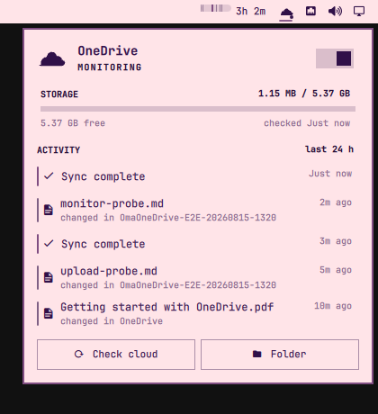
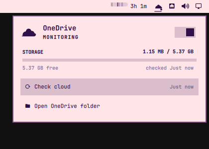
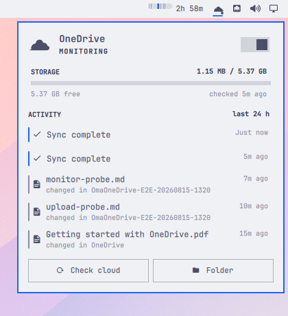

# OmaOneDrive

OneDrive for the Omarchy Quattro bar. OmaOneDrive connects to the installed
[OneDrive Client for Linux](https://github.com/abraunegg/onedrive), follows its
systemd user service, and presents the same sort of compact status panel as
Omarchy's Dropbox widget.

## Screenshots







Captured against a real OneDrive account in a disposable Omarchy VM.

## What it does

- Shows whether OneDrive is monitoring, syncing, paused, or needs attention.
- Adds distinct missing-client, login, paused, and syncing badges to the bar
  icon, with a plain dot for the healthy monitoring state.
- Pauses and resumes `onedrive.service` from a native Omarchy toggle.
- Opens the CLI's browser-based login flow in a terminal when authentication is
  missing.
- Shows used and free cloud storage in a compact usage meter.
- Merges successful syncs, service errors, and recent local changes into an
  honest activity timeline.
- Offers a Full layout with storage and recent activity, and a shorter Compact
  layout with storage and primary actions.
- Opens the configured sync directory and local files from activity rows.
- Checks Microsoft on demand for exact cloud quota and pending changes.
- Caches only presentation data. It never reads, copies, prints, or stores the
  OneDrive refresh token.

Controls:

- Left-click toggles the panel.
- Middle-click opens the configured OneDrive folder.
- Right-click checks cloud quota and pending changes.
- The panel does not print a permanent key legend, but `R` checks the cloud,
  `P` pauses/resumes sync, `O` opens the folder, `L` opens login, and `Esc`
  closes the panel.

Routine 30-second refreshes are local: they inspect the user service, its
journal, the configured sync path, and cached presentation data. Only the
explicit **Check OneDrive cloud** action runs `onedrive --display-quota` and
`onedrive --display-sync-status`.

## Requirements

- Omarchy Quattro with the Quickshell plugin system.
- Python 3.
- The abraunegg `onedrive` CLI and its `onedrive.service` systemd user unit.
- Nautilus for selecting a recent file; opening the sync folder uses the system
  default file manager.

On Arch/Omarchy, the client package used for development was
`onedrive-abraunegg`. Install and authenticate it before enabling continuous
sync:

```bash
omarchy-pkg-add onedrive-abraunegg
onedrive
systemctl --user enable --now onedrive.service
```

The current client opens the Microsoft login page automatically in a graphical
desktop. If it falls back to the manual flow, follow the URL and paste the final
redirect URL into the same terminal. OmaOneDrive does not handle credentials.

## Install

The plugin installer expects a Git repository. From a published repository:

```bash
omarchy plugin add https://github.com/salemsayed/omaonedrive.git --enable
omarchy bar move io.github.salemsayed.omaonedrive --section right --index 0
```

To test a local Git checkout:

```bash
omarchy plugin validate ~/Coding/omarchy-onedrive
omarchy plugin add file://$HOME/Coding/omarchy-onedrive --enable
```

## Configure

```bash
omarchy bar set io.github.salemsayed.omaonedrive refreshIntervalSec 30 --json
omarchy bar set io.github.salemsayed.omaonedrive recentFileLimit 20 --json
omarchy bar set io.github.salemsayed.omaonedrive panelStyle Compact --json
```

`refreshIntervalSec` is bounded to 10–3600 seconds, `recentFileLimit` to 5–50
files, and `panelStyle` accepts `Full` or `Compact`. Full shows storage plus the
activity timeline; Compact shows storage and the two primary actions.
Recent-file scans are cached for two minutes independently of the panel refresh
interval.

IPC actions are also available:

```bash
omarchy-shell io.github.salemsayed.omaonedrive status
omarchy-shell io.github.salemsayed.omaonedrive refresh
omarchy-shell io.github.salemsayed.omaonedrive check
omarchy-shell io.github.salemsayed.omaonedrive pause
omarchy-shell io.github.salemsayed.omaonedrive resume
omarchy-shell io.github.salemsayed.omaonedrive folder
omarchy-shell io.github.salemsayed.omaonedrive open
```

## Remove and roll back

Removing the plugin does not stop, disable, log out, or uninstall OneDrive:

```bash
omarchy plugin disable io.github.salemsayed.omaonedrive
omarchy plugin remove io.github.salemsayed.omaonedrive
```

The non-sensitive status cache is retained. To remove only that cache:

```bash
rm -r -- "$HOME/.local/state/omarchy/io.github.salemsayed.omaonedrive"
```

If `XDG_STATE_HOME` is set, use that location instead of
`$HOME/.local/state`.

## Safety boundary

OmaOneDrive performs no file upload, download, deletion, resync, logout, or
configuration edit. Pause/resume is limited to `systemctl --user stop/start
onedrive.service`. The cloud check uses the client's read-only display modes.
Activity file rows are accurately labeled **changed in** their local folder; a
recent local timestamp alone is not proof that Microsoft has accepted that
individual file.

## License

[MIT](LICENSE)
